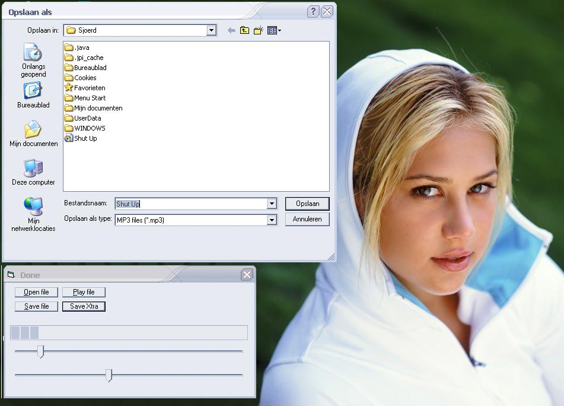



## MP3 Splitter \(working\)

### Description

Hi,

This code can split a MP3 file and save it as new file.

U can easily cut out the best pieces from a MP3 and save it as a new one.

The GUI looks bad but it works and it's fast and I think that's important.

I've uploaded coz there's only one MP3 splitter to be found on pscode (as far as i've seen) and it isn't finished jet.

Just try and vote/comment
 
### More Info
 

             |
---                |---
**Submitted On**   |2004-02-07 13:44:02
**By**             |[Sjoerd](https://github.com/Planet-Source-Code/PSCIndex/blob/master/ByAuthor/sjoerd.md)
**Level**          |Intermediate
**User Rating**    |4.5 (18 globes from 4 users)
**Compatibility**  |VB 6\.0
**Category**       |[Sound/MP3](https://github.com/Planet-Source-Code/PSCIndex/blob/master/ByCategory/sound-mp3__1-45.md)
**World**          |[Visual Basic](https://github.com/Planet-Source-Code/PSCIndex/blob/master/ByWorld/visual-basic.md)
**Archive File**   |[MP3\_Splitt170543272004\.zip](https://github.com/Planet-Source-Code/sjoerd-mp3-splitter-working__1-51569/archive/master.zip)

